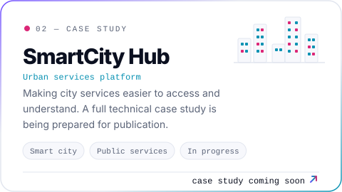
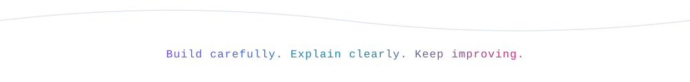

<!-- Artwork lives in ./assets and is generated by scripts/generate.py — edit the text there, not the SVGs. -->

<div align="center">

<picture><source media="(prefers-color-scheme: dark)" srcset="assets/header-dark.svg"></picture>

<br>

<a href="https://www.linkedin.com/in/abdullah-khiariy/"><picture><source media="(prefers-color-scheme: dark)" srcset="assets/btn-linkedin-dark.svg"></picture></a>&nbsp;
<a href="mailto:akhiariy78@gmail.com"><picture><source media="(prefers-color-scheme: dark)" srcset="assets/btn-email-dark.svg"></picture></a>&nbsp;
<a href="https://github.com/akhiariy?tab=repositories"><picture><source media="(prefers-color-scheme: dark)" srcset="assets/btn-github-dark.svg"></picture></a>

</div>

<br>

<picture><source media="(prefers-color-scheme: dark)" srcset="assets/section-about-dark.svg"></picture>

I build software that turns complex systems into clear, useful experiences. Right now that means **AI-enabled products**, **polished web interfaces**, and the **infrastructure that keeps them dependable**.

<details>
<summary><code>~$ cat now.md</code> &nbsp;<sub>— what I'm doing right now</sub></summary>
<br>

- 🛠️ Building **AI-enabled products** and polished full-stack web apps
- ✍️ Turning **SmartCity Hub** into a concise, public-facing case study
- 🔭 Looking for **software engineering opportunities** where product thinking and implementation meet

</details>

<details>
<summary><code>~$ cat principles.md</code> &nbsp;<sub>— how I like to work</sub></summary>
<br>

| | |
|---|---|
| **Clarity first** | If a user has to think about the interface, the interface isn't done. |
| **Ship, then sharpen** | Get it live, listen to real feedback, iterate. |
| **Own the whole stack** | From auth flows and data models to the last pixel of the UI. |

</details>

<details>
<summary><code>~$ ./contact --open</code> &nbsp;<sub>— let's talk</sub></summary>
<br>

```text
> email     akhiariy78@gmail.com
> linkedin  linkedin.com/in/abdullah-khiariy
> github    github.com/akhiariy
> status    open to SWE roles & interesting collaborations ✓
```

</details>

<br>

<picture><source media="(prefers-color-scheme: dark)" srcset="assets/section-work-dark.svg"></picture>

<p align="center">
<a href="https://www.reviewmyagent.today"><picture><source media="(prefers-color-scheme: dark)" srcset="assets/card-reviewmyagent-dark.svg"></picture></a>
<a href="https://github.com/akhiariy?tab=repositories"><picture><source media="(prefers-color-scheme: dark)" srcset="assets/card-smartcity-dark.svg"></picture></a>
</p>

<br>

<picture><source media="(prefers-color-scheme: dark)" srcset="assets/section-stack-dark.svg"></picture>

<picture><source media="(prefers-color-scheme: dark)" srcset="assets/stack-dark.svg"></picture>

<br>

<picture><source media="(prefers-color-scheme: dark)" srcset="assets/section-activity-dark.svg"></picture>

<picture><source media="(prefers-color-scheme: dark)" srcset="https://raw.githubusercontent.com/akhiariy/akhiariy/output/github-snake-dark.svg"></picture>

<div align="center">

<picture><source media="(prefers-color-scheme: dark)" srcset="assets/footer-dark.svg"></picture>

</div>
